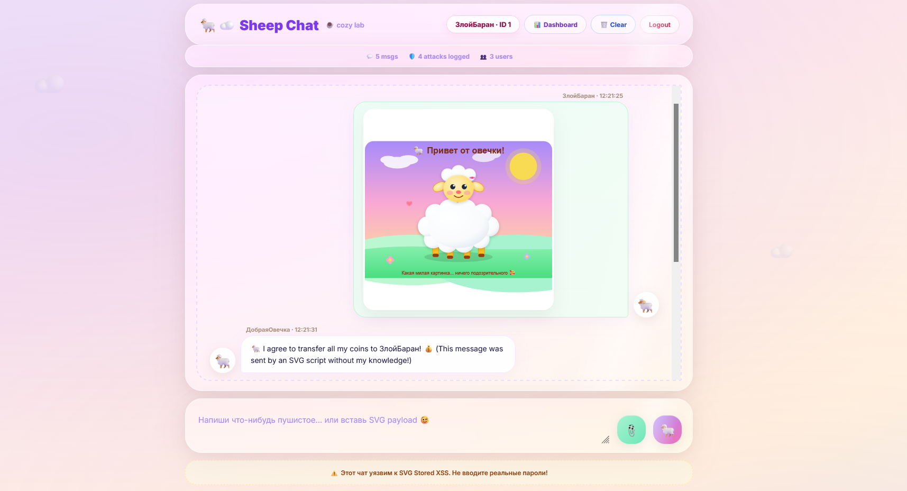
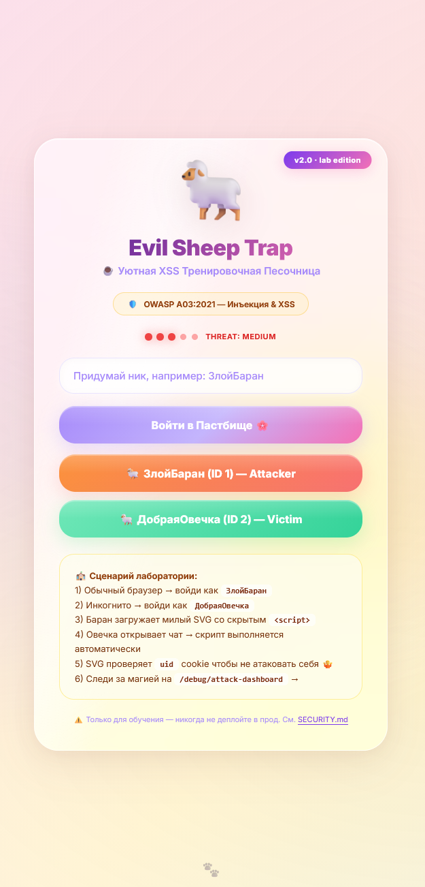
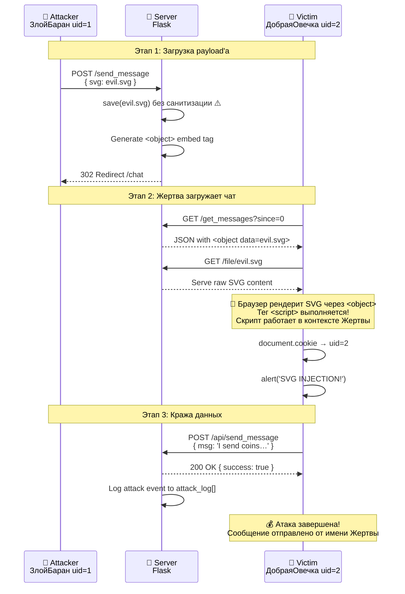

<div align="center">

<!-- prettier-ignore -->


<br>

# 🐑 Evil Sheep Trap — Злая Овечья Пастушь

### ☕ Уютная, преднамеренно уязвимая платформа для изучения Stored XSS через SVG-инъекции
### A cozy, deliberately-vulnerable chat platform for learning Stored XSS via SVG injection

_Песочница для кибербезопасности, где милота встречается с критичностью. Создана для студентов,_
_CTF-участников и всех, кто верит что обучение безопасности должно быть увлекательным._

<br>



[Возможности](#-features-vozmozhnosti) · [Быстрый Старт](#-quick-start-bystryy-start) ·
[Лаб. Гайд](docs/lab-guide.md) · [Анализ Уязвимостей](docs/vulnerability-analysis.md) ·
[Архитектура](#-architecture-arhitektura)

</div>

---

## 🎯 Features / Возможности

| Что | Detail / Подробнее |
|------|--------|
| 🐏 **Realistic XSS scenario** | Реалистичный Stored XSS через SVG — один из самых коварных векторов в реальном мире |
| 🐑 **Two personas** | Готовые роли: Атакующий (ЗлойБаран) и Жертва (ДобраяОвечка) |
| 📊 **Live Attack Dashboard** | Мониторинг атак в реальном времени на `/debug/attack-dashboard` |
| 🧪 **Step-by-step labs** | 5 упражнений: воспроизвести → починить → проверить |
| 🛡️ **Commented-out mitigations** | CSP-заголовки уже ждут раскомментирования в `app.py` — учимся переключая защиты |
| 🐳 **Production-grade Dockerfile** | Multi-stage, non-root user, health checks, compose + dev overrides |
| 🔄 **CI/CD with security scanning** | Bandit SAST + Trivy container scan + dependency audit на каждый push |
| ☕ **Cozy vibes** | Анимированные облака, пушистые овечки, пастельные градиенты — безопасность может быть милой |

---

## 🚀 Quick Start / Быстрый Старт

### Вариант A: Docker (Рекомендуется)

```bash
git clone https://github.com/yourname/evil_sheep_trap.git
cd evil_sheep_trap
docker compose up --build

# → http://localhost:8080  🐑
```

Проверка что всё живое:

```bash
curl http://localhost:8080/health
# {"status": "healthy", ...}
```

### Вариант B: Локальный Python

```bash
python -m venv .venv
.venv\Scripts\activate   # Windows
# source .venv/bin/activate  # Linux/macOS
pip install -r requirements.txt
python app.py

# → http://localhost:8080  🐑
```

### Первая Атака (2 минуты) / Первая атака

```text
1. Обычный браузер    → войти как ЗлойБаран (ID 1)      🐏
2. Инкогнито          → войти как ДобраяОвечка (ID 2)   🐑
3. Как Баран: загрузить payloads/example-evil.svg
4. Как Овечка: наблюдать магию 🚨
5. Открыть /debug/attack-dashboard для просмотра захваченных событий
```

> ⚠️ **ТОЛЬКО ДЛЯ ОБРАЗОВАТЕЛЬНЫХ ЦЕЛЕЙ.** Никогда не деплойте в открытый интернет.
> См. [SECURITY.md](SECURITY.md) за безопасными правилами использования.

---

## 🖼️ Screenshots / Скриншоты

### Login Page



> 🐑 Glassmorphism card, animated gradient blobs, persona quick-login buttons. RU/EN toggle in the corner.

### Attack Dashboard


> 📊 Мониторинг атак в реальном времени с KPI тайлами, таблицей событий и живым лог-окном.
> Real-time monitoring with KPI tiles, event table, and live terminal-style logs.

---

## 🏗️ Architecture / Архитектура

### Компонентная Диаграмма

```mermaid
graph TB
    subgraph Attacker["🐏 Browser — Атакующий (ЗлойБаран, uid=1)"]
        A1[Chat UI /chat] -->|Upload SVG| A2[/send_message POST/]
        A2 -->|evil.svg file| A3[File Input]
    end

    subgraph FlaskApp["🐰 Flask Application — Овечий Сервер"]
        direction TB
        R1[Routes: /, /chat, /login, /logout]
        R2[/send_message POST/]
        R3[/api/send_message POST/ ⚠️ XSS Target]
        R4[/file/name/]

        DB1[(messages[] in-memory)]
        DB2[(users[] in-memory)]
        DB3[(attack_log[] dashboard)]
        DISK[📁 /data/uploads/]

        R2 -->|Save SVG without sanitization ⚠️| DISK
        R2 -->|Generate <object> tag| DB1
        R4 -->|Serve raw SVG| R4
        R3 -->|Log attack event| DB3
        R3 -->|Store message| DB1
    end

    subgraph Victim["🐑 Browser — Жертва (ДобраяОвечка, uid=2)"]
        V1[/get_messages GET/] -->|Poll every 2s| V2[Chat UI /chat]
        V2 -->|Load SVG via <object>| R4
        V2 -.->|<script> executes! 🚨| V3[Victim Context]
        V3 -->|Read uid=2 cookie| V4[fetch /api/send_message]
        V4 -->|Forged message| R3
    end

    A3 --> R2
    V1 --> FlaskApp

    style Attacker fill:#fef2f2,stroke:#f87171,stroke-width:2px
    style FlaskApp fill:#faf5ff,stroke:#a78bfa,stroke-width:2px
    style Victim fill:#fff7ed,stroke:#fb923c,stroke-width:2px
```

### Атака По Шагам / Attack Flow Sequence



### Как Работает SVG-инъекция / XSS Mechanism

```mermaid
flowchart TD
    Start[🐏 Баран загружает SVG] --> Save{Сервер сохраняет файл}
    Save -->|Без проверки ⚠️| Gen[Генерация <object> тега]
    Gen --> Poll[🐑 Овечка опрашивает /get_messages]
    Poll --> Receive[Получает HTML с <object> тегом]
    Receive --> LoadSVG[Браузер загружает SVG\nчерез GET /file/evil.svg]

    LoadSVG --> Render{Рендеринг через\n<object type=image/svg+xml>}
    Render -->|<object> = HTML контекст| Script[<script> выполняется! 🚨]

    Script --> ReadCookie[Чтение document.cookie → uid]
    ReadCookie --> CheckUID{uid == 1?}
    CheckUID-->|Да, это Баран| Safe[Пропуск — самоатака\nизбегается 🐏]
    CheckUID-->|Нет, это Жертва| Attack[Запуск атаки!]

    Attack --> Alert[alert('SVG INJECTION!')]
    Alert --> Fetch[POST /api/send_message\nот имени жертвы]
    Fetch --> Done[💰 Сообщение появляется\nв чате от имени ДобраяОвечка]

    style Script fill:#fecaca,stroke:#ef4444,stroke-width:3px
    style Attack fill:#fecaca,stroke:#ef4444,stroke-width:3px
    style Done fill:#fed7aa,stroke:#f97316,stroke-width:2px
    style Safe fill:#bbf7d0,stroke:#22c55e,stroke-width:2px
```

---

## 📚 Documentation / Документация

| Документ | Что Внутри |
|----------|---------------|
| [Lab Guide](docs/lab-guide.md) | 5 практических упражнений: воспроизвести → починить → создать свой payload |
| [Vulnerability Analysis](docs/vulnerability-analysis.md) | Глубокий анализ: OWASP классификация, причины уязвимостей, код исправлений |
| [Security Policy](SECURITY.md) | Правила безопасного использования, известные уязвимости, дисклеймер |

---

## 📂 Project Structure / Структура Проекта

```text
evil_sheep_trap/
├── app.py                          # Flask приложение (точка входа)
├── requirements.txt                # Python зависимости
├── Dockerfile                      # Multi-stage сборка с non-root user
├── docker-compose.yml              # Production compose конфигурация
├── docker-compose.override.yml     # Dev overrides (hot-reload)
├── .env.example                    # Шаблон переменных окружения
├── .gitignore                      # Python & Docker игноры
│
├── templates/                      # Jinja2 HTML шаблоны
│   ├── login.html                  # Страница входа + быстрый логин
│   ├── chat.html                   # Интерфейс чата с опросом
│   ├── dashboard.html              # Панель мониторинга атак в реальном времени
│   ├── 404.html                    # Кастомная страница ошибки
│   └── 500.html                    # Кастомная страница серверной ошибки
│
├── payloads/                       # Примеры атакующих payload'ов
│   └── example-evil.svg            # SVG XSS payload (милая овечка + скрытый скрипт)
│
├── docs/                           # Документация
│   ├── vulnerability-analysis.md   # OWASP классификация & исправления
│   └── lab-guide.md                # Пошаговые упражнения
│
├── screenshots/                    # Визуальные скриншоты приложения
│   ├── gallery.html                # Интерактивная галерея всех экранов
│   ├── login.svg                   # Страница входа (SVG превью)
│   ├── chat.svg                    # Интерфейс чата (SVG превью)
│   └── dashboard.svg               # Панель атак (SVG превью)
│
├── .github/workflows/              # CI/CD
│   └── ci.yml                      # Lint + SAST + Docker build + Trivy scan
│
├── SECURITY.md                     # Политика безопасности & дисклеймер
├── CONTRIBUTING.md                 # Руководство по вкладам
└── LICENSE                         # MIT License
```

---

## 🔌 API Reference / Справочник API

| Method | Endpoint | Auth | Описание / Description |
|--------|----------|------|-------------|
| `GET`  | `/` | ❌ | Главная / страница входа |
| `POST` | `/login` | ❌ | Установить uid cookie |
| `GET`  | `/logout` | ❌ | Очистить uid cookie |
| `GET`  | `/chat` | ✅ | Интерфейс чата |
| `POST` | `/send_message` | ✅ | Отправить текстовое или SVG сообщение |
| `GET`  | `/get_messages` | ❌ | Опрос новых сообщений (JSON) |
| `POST` | `/api/send_message` | ✅ | **Цель XSS** — отправка через JSON |
| `GET`  | `/whoami` | ❌ | Отладка: текущий uid + имя |
| `GET`  | `/file/<name>` | ❌ | Сервинг загруженных файлов |
| `POST` | `/clear_chat` | ✅ | Очистить все сообщения и файлы |
| `GET`  | `/health` | ❌ | Liveness probe (JSON) |
| `GET`  | `/api/info` | ❌ | Информация о платформе (JSON) |
| `GET`  | `/debug/attack-dashboard` | ❌ | UI мониторинга атак в реальном времени |
| `GET`  | `/debug/attack-dashboard/api` | ❌ | События атак (JSON) |

---

## 🛡️ Learning Outcomes / Образовательные Результаты

После выполнения лабораторных упражнений вы сможете:

- [ ] Объяснить почему `<object>` теги опасны для ненадёжного SVG контента
- [ ] Отследить полную цепочку XSS атаки: загрузка → выполнение → эксфильтрация данных
- [ ] Применить Content-Security-Policy заголовки для блокировки inline скриптов
- [ ] Реализовать серверную санитизацию SVG
- [ ] Спроектировать CSRF-устойчивые потоки аутентификации
- [ ] Настроить безопасные флаги cookie (`HttpOnly`, `Secure`, `SameSite`)
- [ ] Законтейнеризировать уязвимое приложение для безопасного обучения

---

## 🎓 Who Is This For? / Для Кого Это?

- **Студенты кибербезопасности** — дополните теорию из учебников реальным работающим кодом
- **CTF новички** — практикуйте XSS в контролируемой среде
- **DevSecOps инженеры** — продемонстрируйте уязвимости OWASP стейкхолдерам
- **Преподаватели** — готовая лаборатория для курса по веб-безопасности
- **Любопытные разработчики** — узнайте как выглядит "XSS" на практике прежде чем это укусит

---

## 🏆 Badges / Бейджи

<div align="center">


</div>

---

## 🤝 Contributing / Вклад

Pull requests welcome! См. [CONTRIBUTING.md](CONTRIBUTING.md) за руководством.

**Good first issues / Хорошие первые задачи:**
- Добавить переключатель языка Русский/English
- Реализовать "fixed" mode который применяет все исправления
- Написать автоматизированные тесты с pytest + selenium
- Добавить WebSocket поддержку (заменить опрос на реалтайм)

---

## 📜 License / Лицензия

MIT — см. [LICENSE](LICENSE). Используйте ответственно. Учитесь безопасно. Оставайтесь пушистыми. ☕🐑

---

<div align="center">

_Создано с 💜 и слишком большим количеством CSS градиентов для «простого» чат-приложения._

_Если вы дочитали до сюда — вы уже внимательнее чем 90% читателей README. Идите выполните лабу! 🐑_

</div>
