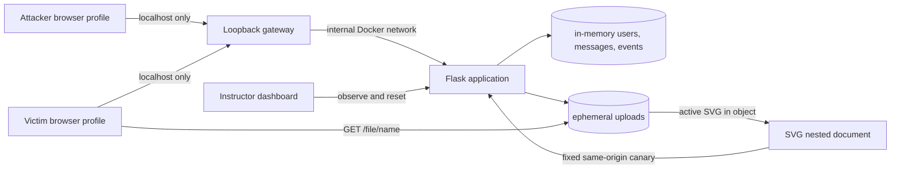

# Architecture and Security Model

## Scope

Pikov WebSec Lab: Evil Sheep Trap состоит из одного Flask-приложения, двух
логических браузерных ролей и одноразового хранилища uploads. Модель описывает
учебный запуск на одной машине или в отдельной закрытой сети; публичное
развертывание не входит в поддерживаемую архитектуру.

## Компоненты и данные

| Компонент | Назначение | Допустимые данные |
|---|---|---|
| Flask | Маршруты входа, чата, upload, file serving и evidence dashboard | Только вымышленные идентификаторы, фиксированные события и одноразовая correlation |
| Loopback gateway | Единственный опубликованный вход; фиксированно проксирует только к Flask | HTTP-запросы к этому учебному экземпляру |
| Память процесса | Пользователи, адресные сообщения, события текущего запуска | Одноразовые данные занятия |
| `/data/uploads` | SVG текущего запуска | Только предоставленный canary |
| Два браузерных профиля | Разделение атакующего и жертвы | Учебные cookie без реальных учетных данных |
| Dashboard | Наблюдение и reset | Минимальные события без содержимого cookie |

## Границы доверия

1. **Браузер → Flask.** Любой текст, имя файла, JSON и cookie считаются
   недоверенными.
2. **Flask → браузер.** Выданный SVG является активным содержимым, пока не
   доказано обратное строгой проверкой.
3. **Контейнер → хост.** Намеренная XSS не должна давать дополнительные
   возможности на уровне ОС.
4. **Один экземпляр → другой слушатель.** Состояние и uploads нельзя совместно
   использовать между независимыми слушателями или парами.
5. **Учебная сеть → внешняя сеть.** Flask-контейнер не имеет внешней сети.
   Browser выполняется на хосте, поэтому преподаватель дополнительно применяет
   private network/firewall; CSP выданного SVG разрешает соединения только с
   тем же origin.

## Намеренно уязвимая цепочка

В vulnerable-режиме сервер сохраняет SVG, создает контролируемую приложением
разметку `<object type="image/svg+xml">` в сообщении для жертвы и отдает файл с
того же origin. Браузер жертвы
создает для SVG отдельный вложенный документ. Script выполняется в этом
документе; совпадение scheme/host/port разрешает same-origin взаимодействие с
приложением. Это ограниченное ослабление является предметом лабораторной.

Не являются частью разрешенной поверхности: выполнение серверного кода, чтение
файлов хоста, доступ к Docker socket, внешняя эксфильтрация, SSRF, межконтейнерное
вмешательство и сохранение данных после reset.

## Защитная граница выполнения

Базовый Compose-запуск должен сохранять следующие инварианты независимо от
режима лабораторной:

- публикация только gateway на `127.0.0.1`; Flask не имеет host-порта;
- отдельная internal-сеть между gateway и Flask; у Flask нет внешнего egress;
- непривилегированный пользователь, `cap_drop: ALL` и `no-new-privileges`;
- read-only root filesystem и ограниченные `tmpfs` для временной записи;
- лимиты памяти, CPU и PID;
- отсутствие host bind mounts и Docker socket в обычном запуске;
- `DEBUG=false`, одноразовые секреты и отсутствие реальных данных.

Этот baseline соответствует практическим правилам `#1–#5a`, `#7` и `#8` из
[OWASP Docker Security Cheat Sheet](https://cheatsheetseries.owasp.org/cheatsheets/Docker_Security_Cheat_Sheet.html):
не передавать daemon socket, запускать non-root, ограничивать capabilities и
ресурсы, запрещать повышение привилегий, контролировать сеть, привязывать порт к
loopback и использовать read-only filesystem.

Dev override осознанно расширяет поверхность за счет read-only bind mounts и
debug-режима. Его применяют только локально и явно.

## Vulnerable и hardened

Режим задается `LAB_MODE` до запуска процесса; это не переключатель, доступный
слушателю через браузер.

| Свойство | `vulnerable` | `hardened` — критерий приемки |
|---|---|---|
| Active SVG upload | Принимается для лабораторной | Отклоняется: HTTP 415, `active_svg_blocked` |
| Встраивание | `<object>` создает nested document | Активный `<object>` не создается |
| CSP | Parent допускает учебный `<object>`; сам SVG разрешает inline canary и только `connect-src 'self'` | Содержит `object-src 'none'` и не создает object |
| Canary | Локальный маркер достигает приложения | Тот же файл не может выполнить callback |
| Evidence | Показывает цепочку выполнения | Содержит `CONTROL_BLOCKED` без событий выполнения |

`hardened` не должен просто скрывать результат на UI: блокировка подтверждается
HTTP-, DOM- и браузерными доказательствами.

## Активы и угрозы

Защищаемые активы — хост преподавателя, другие слушатели, сеть организации,
реальные учетные данные и целостность методических материалов. Предполагается,
что слушатель может полностью управлять вводом внутри выделенного экземпляра,
но не имеет разрешения атаковать границу контейнера или соседние системы.

Основные меры снижения риска: минимальная область, отдельный экземпляр на пару,
internal network для Flask, CSP с same-origin callback для active SVG, безопасный
canary, принудительный reset и отсутствие долговременного хранения. Внешний
доступ самого host browser контролируется правилами занятия/межсетевым экраном.
Подробнее см. [SECURITY.md](../SECURITY.md).

## Проверяемые инварианты

Перед занятием преподаватель подтверждает:

1. `http://127.0.0.1:8080/health` доступен, а адрес хоста в публикации порта —
   loopback;
2. контейнер не privileged и не имеет дополнительных capabilities;
3. canary не содержит внешних callback-URL или чтения данных; он получает только
   `payload_id` и `marker` из query собственного server-issued URL;
4. vulnerable-результат воспроизводится только внутри своего экземпляра;
5. reset очищает сообщения, события и uploads;
6. hardened-повтор блокирует тот же canary как минимум двумя независимыми
   контролями.
